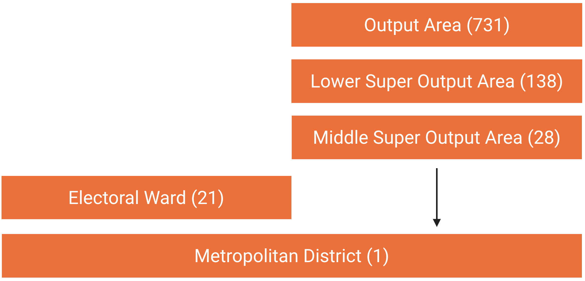

Estimates of the usual resident population for 2017 in the Metropolitan District of Trafford and for 2016 in Electoral Wards, MSOAs, LSOAs and OAs derive from the [Office for National Statistics](https://www.ons.gov.uk/peoplepopulationandcommunity/populationandmigration/populationestimates).

Five different geographical units are shown in this application:

- **Metropolitan District**
- **Electoral Ward**: The boundaries of Electoral Wards are determined by electoral review.
- **Middle Super Output Area (MSOA)**: MSOAs are groups of LSOAs and contain 5,000 to 15,000 residents and 2,000 to 6,000 households.
- **Lower Super Output Area (LSOA)**: LSOAs are combined from Output Areas and contain 1,000 to 3,000 residents and 400 to 1,200 households.
- **Output Area (OA)**: OAs are the smallest geographical unit and are created from postcode sectors. They contain a minimum of 100 residents and 40 households.

The five geographical units belong to two different hierarchies: administrative and statistical. Metropolitan Districts and Electoral Wards sit within an administrative hierarchy whilst OAs, LSOAs, and MSOAs belong to a statistical hierarchy. The statistical geographical units fit within each other and Metropolitan Districts but not Electoral Wards.

Nesting statistical and administrative geographical units

